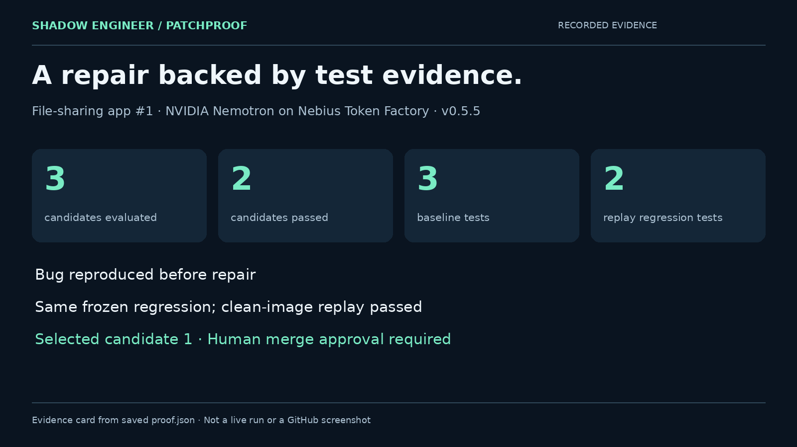

# Shadow Engineer

**Label a bug. Review a repair backed by independent test evidence.**

Shadow Engineer is a GitHub Actions MVP. Its PatchProof engine generates a
regression before asking a solver for a patch, evaluates three repair candidates
in isolated Nebius Token Factory sandbox branches, and replays the winner from a
clean base image before opening a pull request. A human decides whether to merge.

**Engine: v0.6.0-rc.2 · Recorded verification evidence: v0.5.5 · Track: Coding and Agentic Engineering**

[Setup](docs/SETUP.md) · [Compatibility](docs/COMPATIBILITY.md) · [Architecture](docs/ARCHITECTURE.md) ·
[Recorded evidence](docs/EVIDENCE.md) · [Demo script](docs/DEMO.md) ·
[Submission text](docs/SUBMISSION.md)



## A demonstrated repair

The file-sharing app displayed JavaScript expression fragments where users should
see file sizes such as `1.0 KB`. Its speed display inherited the same defect.

- [Bug report: file-sharing-app #1](https://github.com/creatoropener/file-sharing-app/issues/1)
- [Generated repair: PR #2](https://github.com/creatoropener/file-sharing-app/pull/2)
- [Successful workflow run](https://github.com/creatoropener/file-sharing-app/actions/runs/35464615209)

The green run records **three candidates evaluated, two passing and one rejected**,
an unchanged regression hash, and clean replay with **three baseline tests plus
two regression tests**. Candidate 1 won. The rejected candidate omitted the space
in `1.0 KB`, which the hidden regression caught. An earlier v0.5.5 run had different
counts and is retained separately. These are recorded results, not fresh tests run during release packaging.
See [evidence provenance](docs/EVIDENCE.md) for the distinct runs and their sources.

## Why the verification is separate

Generating a plausible patch is only part of repair. A maintainer also needs to
know that the bug existed, that the patch addresses it, and that existing behavior
survives. PatchProof makes those steps explicit and keeps the new regression out
of solver prompts. The verifier and solver use separate calls to the configured
model; they are not independent model vendors or a formal proof system.

1. A user adds `shadow-fix` to an issue in an installed target repository.
2. PatchProof checks the selected image, runtime and existing baseline before inference.
3. The verifier drafts a regression and demonstrates a real assertion failure.
4. Three solver strategies propose small, exact-match source edits.
5. Each candidate must pass existing tests and the frozen regression.
6. The selected patch must pass again from a clean sandbox image.
7. The workflow creates or updates one PR per issue, with the verification report.

Candidates run **sequentially in separate branches**, not concurrently. Existing
baseline failures can be supplied for one bounded correction. Hidden-regression
results are never fed back to a solver. Details: [architecture](docs/ARCHITECTURE.md).

## Install in a target repository

Export the installation files, then copy their contents into the target repository:

```bash
python3 tools/export_target.py --output ../patchproof-target-v0.6.0-rc.2.zip
```

Configure `NEBIUS_API_KEY`, `NEBIUS_PROJECT_ID`, `NEBIUS_MODEL`, and a compatible
sandbox image; commit the workflows to the default branch; then apply the issue
label. Repository-specific test setup is described in [SETUP.md](docs/SETUP.md).
The file-sharing example uses the explicit `node-typescript` adapter, a repository
baseline executed with pinned `tsx`, and engine-owned Web Streams test plumbing.
The setup files are included under `examples/file-sharing-setup/`.

This main repository contains the engine. The linked file-sharing repository is
the demonstrated target. Installing a GitHub App from a marketplace is not part
of this MVP.

## Runtime scope

| Adapter | Toolchain | Evidence in this release |
| --- | --- | --- |
| `node-typescript` | Package baseline + pinned tsx + TypeScript checker + Node test runner | v0.6 acceptance run pending; fail-fast and local contract checks included |
| `node-package` | JavaScript package baseline + Node test runner | JavaScript-only path; no v0.6 live evidence bundled |
| `python-pytest` | Python + pytest | Adapter included; no current-release live evidence bundled |
| `static-web` | Syntax check + Node/jsdom regression | Adapter included; QRcrafts verification remained unresolved |
| `web-playwright` | Python pytest + Playwright | Adapter included; no live evidence bundled |
| `java-junit` | javac + standalone JUnit | Adapter included; no live evidence bundled |
| `java-maven` | Maven + JUnit reports | Adapter included; no live evidence bundled |
| `java-gradle` | Gradle wrapper + JUnit reports | Adapter included; no live evidence bundled |
| `go` | Go modules + native tests | Adapter included; no live evidence bundled |
| `rust` | Cargo integration tests | Adapter included; no live evidence bundled |

One build root is selected per run. TypeScript tests are statically checked against
the target's real API declarations and then execute through pinned `tsx` with normal
project imports; the retired source loader is no longer used. The engine supplies
only generic byte-stream plumbing for Web Streams tests. Passing
a repository baseline does not establish that an entire Next.js app builds or
works. Known limits and trust boundaries are in [ARCHITECTURE.md](docs/ARCHITECTURE.md).

## Nebius and NVIDIA

`proof.py` calls the Nebius Token Factory inference API. The demonstrated model is
`nvidia/Nemotron-3_5-Lightning`. Repository bootstrap commands, test execution,
candidate evaluation, and clean replay use Nebius Sandboxes through `contree-sdk`.
The GitHub runner orchestrates requests and handles the resulting PR.

The model emits edit instructions; Python validates and assembles those edits on
the runner before sending candidate files to the sandbox. This is not a claim
that all orchestration or patch assembly executes inside Nebius.

## Repository map

- `proof.py`: inference, validation, candidates, replay and reports.
- `runtimes.py`: runtime detection, commands and native-result classification.
- `patchproof_runtime/`: engine-owned sandbox and test-plumbing helpers.
- `.github/workflows/`: image preparation and issue-to-PR orchestration.
- `docs/`: setup, architecture, recorded evidence and submission materials.
- `legacy/v0.2/`: preserved prototype, CLI, tests and historical fixtures; not the
  current release entry point or evidence for today's hosted workflow.

## Verification status and license

The demonstrated v0.5.5 target ran on Nebius. The v0.6 TypeScript adapter is a
release candidate until the documented Issue #3 acceptance run passes. Engine
contract tests and static checks do not replace that sandbox acceptance run.

The engine is released under the existing [MIT license](LICENSE), copyright
Tabloop. This is a reproducible MVP with recorded evidence, not a production
service, security audit, or guarantee that generated tests cover every bug.
