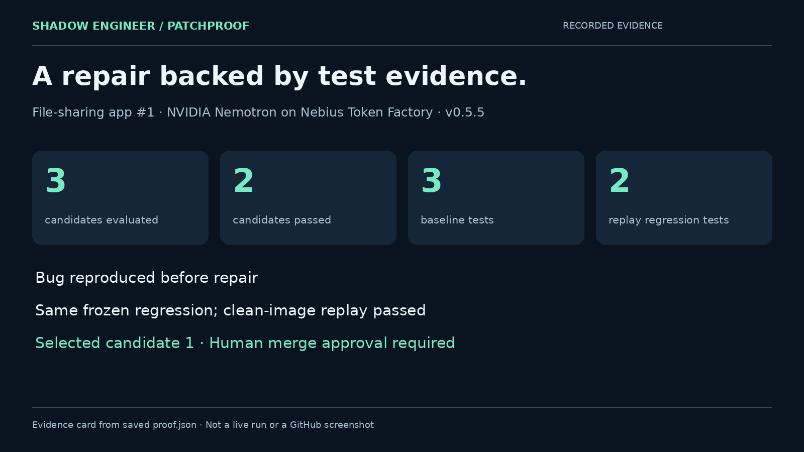

# Shadow Engineer

**Label a bug. Review a repair backed by independent test evidence.**

Shadow Engineer is a GitHub Actions MVP. Its PatchProof engine generates a
regression before asking a solver for a patch, evaluates three repair candidates
in isolated Nebius Token Factory sandbox branches, and replays the winner from a
clean base image before opening a pull request. A human decides whether to merge.

**Engine: v0.6.0-rc.21 (frozen for evaluation) · Recorded repairs: three, on two repositories · Track: Coding and Agentic Engineering**

[Setup](docs/SETUP.md) · [Compatibility](docs/COMPATIBILITY.md) · [Architecture](docs/ARCHITECTURE.md) ·
[Recorded evidence](docs/EVIDENCE.md) · [Demo script](docs/DEMO.md) ·
[Submission text](docs/SUBMISSION.md)



## Recorded repairs

Three repairs on two repositories reached a VERIFIED verdict and a pull request:

| Repair | Engine / adapter | What was wrong |
| --- | --- | --- |
| file-sharing-app #1 (PR #2) | v0.5.5, Node | Size and speed formatting printed raw template text |
| file-sharing-app #3 | v0.6.0-rc.12, `node-typescript` | Every P2P chunk failed its AES-GCM auth-tag check because the per-stream IV seed was never transmitted |
| QRcrafts #1 (PR #3) | v0.6.0-rc.15 and rc.20, `node-typescript` | WiFi QR codes did not escape the reserved characters `;` `,` `:` `\` and `"` |

All three are recorded in [docs/EVIDENCE.md](docs/EVIDENCE.md). The first is described in detail below.

### file-sharing-app #1

The file-sharing app displayed JavaScript expression fragments where users should
see file sizes such as `1.0 KB`. Its speed display inherited the same defect.

- [Bug report: file-sharing-app #1](https://github.com/creatoropener/file-sharing-app/issues/1)
- [Generated repair: PR #2](https://github.com/creatoropener/file-sharing-app/pull/2)
- [Successful workflow run](https://github.com/creatoropener/file-sharing-app/actions/runs/35464615209)

The green run records **three candidates evaluated, two passing and one rejected**,
an unchanged regression hash, and clean replay with **three baseline tests plus
two regression tests**. Candidate 1 won. The rejected candidate omitted the space
in `1.0 KB`, which the hidden regression caught. An earlier v0.5.5 run had different
counts and is retained separately. These are recorded results, not fresh tests run during release packaging.
See [evidence provenance](docs/EVIDENCE.md) for the distinct runs and their sources.

## Why the verification is separate

Generating a plausible patch is only part of repair. A maintainer also needs to
know that the bug existed, that the patch addresses it, and that existing behavior
survives. PatchProof makes those steps explicit and keeps the new regression out
of solver prompts. The verifier and solver use separate calls to the configured
model; they are not independent model vendors or a formal proof system.

1. A user adds `shadow-fix` to an issue in an installed target repository.
2. PatchProof checks the selected image, runtime and existing baseline before inference.
3. The verifier drafts a regression and demonstrates a real assertion failure.
4. Three solver strategies propose small, exact-match source edits.
5. Each candidate must pass existing tests and the frozen regression.
6. The selected patch must pass again from a clean sandbox image.
7. The workflow creates or updates one PR per issue, with the verification report.

Candidates run **sequentially in separate branches**, not concurrently. Existing
baseline failures can be supplied for one bounded correction. Hidden-regression
results are never fed back to a solver. Details: [architecture](docs/ARCHITECTURE.md).

## Benchmark: what it does and does not show

The engine is frozen at v0.6.0-rc.21 and was measured on a small benchmark with
three trials per case. Each winning repair was judged against the issue text, not
just by the engine's own verdict. Full tables and caveats are in
[docs/BENCHMARK.md](docs/BENCHMARK.md).

| Split | Cases | Result for rc.21 |
| --- | --- | --- |
| Development (the engine was built against these) | QRcrafts #1, file-sharing-app #1 | **6/6** correct and accepted (rc.20: also 6/6) |
| Held-out (unseen repositories) | Aegisscan SSRF issue, Tabloop form-action issue | **0/6**: the verifier never accepted a test, so no repair was evaluated |

Read this plainly: the engine works on the repositories it was developed against and
**did not generalize** to two unseen repositories. The failures were on the
verification side. There were **no false accepts**, and no unverified patch was
proposed. Two held-out cases, three non-independent trials each, are examples, not
statistics, and the Tabloop case runs on an Experimental adapter. A third development
case (Aegisscan #2) is reported separately in [docs/BENCHMARK.md](docs/BENCHMARK.md)
because its issue text names a helper that does not exist at its base commit.

## Use as a GitHub Action (beta)

The lightest way to try it: add one workflow file that calls
`creatoropener/shadow-patch@v0.6.0-rc.24` and pass your Nebius secrets and sandbox
image. No engine files are copied into your repository. See
[docs/ACTION.md](docs/ACTION.md) and
[examples/action-usage/shadow-fix.yml](examples/action-usage/shadow-fix.yml). The
copy-install route below remains supported.

## Install in a target repository

Export the installation files, then copy their contents into the target repository:

```bash
python3 tools/export_target.py --output ../patchproof-target-v0.6.0-rc.24.zip
```

Configure `NEBIUS_API_KEY`, `NEBIUS_PROJECT_ID`, `NEBIUS_MODEL`, and a compatible
sandbox image; commit the workflows to the default branch; then apply the issue
label. Repository-specific test setup is described in [SETUP.md](docs/SETUP.md).
The file-sharing example uses the explicit `node-typescript` adapter, a repository
baseline executed with pinned `tsx`, and engine-owned Web Streams test plumbing.
The setup files are included under `examples/file-sharing-setup/`.

This main repository contains the engine. The linked file-sharing repository is
the demonstrated target. Installing a GitHub App from a marketplace is not part
of this MVP.

## Runtime scope

| Adapter | Toolchain | Evidence in this release |
| --- | --- | --- |
| `node-typescript` | Package baseline + pinned tsx + semantic lint + TypeScript checker + Node test runner | Recorded: file-sharing-app #3 and QRcrafts #1; benchmark dev 6/6; held-out 0/3 on one unseen repository |
| `node-package` | JavaScript package baseline + Node test runner | Recorded for the v0.5.5 repair only; no v0.6 live evidence |
| `python-pytest` | Python + pytest | Adapter included; no current-release live evidence bundled |
| `static-web` | Syntax check + Node/jsdom regression | Experimental: held-out 0/3 on one unseen site (the verifier rejected a correct reproduction) |
| `web-playwright` | Python pytest + Playwright | Adapter included; no live evidence bundled |
| `java-junit` | javac + standalone JUnit | Adapter included; no live evidence bundled |
| `java-maven` | Maven + JUnit reports | Adapter included; no live evidence bundled |
| `java-gradle` | Gradle wrapper + JUnit reports | Adapter included; no live evidence bundled |
| `go` | Go modules + native tests | Adapter included; no live evidence bundled |
| `rust` | Cargo integration tests | Adapter included; no live evidence bundled |

One build root is selected per run. TypeScript tests are checked for unused
generated-test bindings, statically checked against the target's real API
declarations, and then executed through pinned `tsx` with normal project imports;
the retired source loader is no longer used. The engine supplies only generic
byte-stream plumbing for Web Streams tests. Passing
a repository baseline does not establish that an entire Next.js app builds or
works. Known limits and trust boundaries are in [ARCHITECTURE.md](docs/ARCHITECTURE.md).

## Nebius and NVIDIA

`proof.py` calls the Nebius Token Factory inference API. The first recorded repair
(v0.5.5) used `nvidia/Nemotron-3_5-Lightning`; the later repairs and every benchmark
trial used `nvidia/nemotron-3-super-120b-a12b`. Repository bootstrap commands, test execution,
candidate evaluation, and clean replay use Nebius Sandboxes through `contree-sdk`.
The GitHub runner orchestrates requests and handles the resulting PR.

The model emits edit instructions; Python validates and assembles those edits on
the runner before sending candidate files to the sandbox. This is not a claim
that all orchestration or patch assembly executes inside Nebius.

## Repository map

- `proof.py`: inference, validation, candidates, replay and reports.
- `runtimes.py`: runtime detection, commands and native-result classification.
- `patchproof_runtime/`: engine-owned sandbox and test-plumbing helpers.
- `.github/workflows/`: image preparation and issue-to-PR orchestration.
- `docs/`: setup, architecture, recorded evidence and submission materials.
- `legacy/v0.2/`: preserved prototype, CLI, tests and historical fixtures; not the
  current release entry point or evidence for today's hosted workflow.

## Verification status and license

All three recorded repairs ran on Nebius and are listed in
[docs/EVIDENCE.md](docs/EVIDENCE.md). Engine v0.6.0-rc.21 is frozen: the
benchmark in [docs/BENCHMARK.md](docs/BENCHMARK.md) was measured on this exact tag.
Engine contract tests and static checks do not replace sandbox runs.

## Limitations

- **No generalization is shown.** Held-out is 0/6 on two unseen repositories; development is 6/6.
- **The verifier is the weak point.** On unseen repositories every trial stopped before any repair was evaluated.
- **Nested tests are rejected.** A regression wrapped in `describe(...)` is refused even when it reproduces the real defect, because the engine's assertion-evidence check expects one failure block per failure.
- **Alias guidance is repository-specific.** The `node-typescript` verifier guidance mentions an `@/` import alias. On a repository without that alias the model can use it, the test is rejected, and a verifier attempt is wasted (seen once in the rc.21 benchmark).
- **API type-check.** Tests that call functions that do not exist or are not exported fail the type-check. This ended 4 of the 6 trials on the unseen TypeScript repository.
- **No layout testing.** `static-web` uses jsdom, which cannot evaluate CSS media queries or real layout.
- **Small, hand-judged benchmark.** Five cases on four repositories, one model, labels recorded by the project team rather than an independent oracle.

The engine is released under the existing [MIT license](LICENSE), copyright
Tabloop. This is a reproducible MVP with recorded evidence, not a production
service, security audit, or guarantee that generated tests cover every bug.
