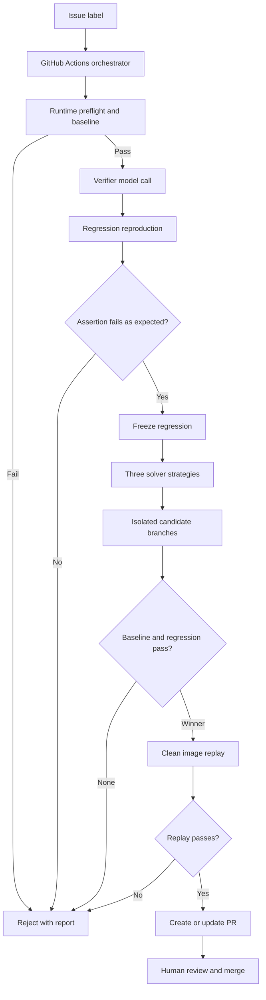

# Architecture and verification boundaries

## Components

The orchestrator runs on GitHub Actions. It calls NVIDIA model inference through
Nebius Token Factory and executes application commands through Nebius Sandboxes.
`RuntimeAdapter` selects files, bootstrap commands, baseline commands and native
test-result interpretation. The same pipeline coordinates supported ecosystems.
The selected sandbox image, runtime executable, dependency bootstrap and existing
baseline are checked before inference, so configuration failures do not consume a
verifier generation request.

## Verifier and solver separation

Repository context is captured before the new regression exists. The verifier
receives the issue and ordinary source/tests. It returns test code and rationale.
The solver receives ordinary repository context, including pre-existing tests,
but not the verifier's generated test or its execution output.

An accepted reproduction needs a recognized assertion failure and an unchanged
test hash. Syntax errors, import errors, skipped tests, zero-test success and a
test already passing on the original source are not sufficient evidence.
Bounded setup retries occur before a reproduced regression is frozen.
For `node-typescript`, each generated test and its imported application modules
are checked for unused initialized bindings on the runner and again with the
target's pinned TypeScript parser in the sandbox. The target's pinned TypeScript
compiler then checks the test and imported application modules. These gates catch
disconnected transforms, wrong API arguments and invalid stream composition before
runtime evidence is considered. Normal project imports then run through pinned
`tsx`. Generic `readableFromBytes` and `collectBytes` helpers provide deterministic
Web Streams plumbing without copying application behavior into the test. These
checks reject a known incomplete test pattern; they do not prove that every used
value contributes meaningfully to the final assertion.

Separate calls can use the same NVIDIA model and share correlated mistakes.
"Independent" describes the workflow and test timing, not statistical model
independence or a guarantee that the generated expectations are correct.

## Candidate branches and correction

Three strategies are evaluated in a sequential loop. Each begins from the same
original baseline snapshot; candidates do not share patched state. Each proposal
is a list of exact source replacements, limited to allowed existing source files.
Tests, workflows, manifests where protected by adapter policy, and engine files
cannot be directly patched. Every accepted proposal must have a net source change.

Invalid proposals get one validation retry with the error. Baseline failures get
one correction, with a fresh branch for the new proposal. These branches exclude
the hidden test, so broad test discovery cannot expose its assertions as feedback.
The frozen test is injected only after baseline success. A hidden-regression
failure rejects that candidate; it does not trigger a solver correction.

For binary-frame or protocol edits, solver instructions require a private
consistency audit of buffer allocation, write/read offsets, producer/consumer
layout, and normal/final emission paths. This reduces common malformed-patch
failures but remains model guidance; compilation, baseline, hidden regression and
clean replay are still the enforcement gates.

All three candidate slots must complete a sandbox evaluation before selection.
The winner is chosen by fewest changed files, then changed lines, then elapsed
time. Different strategies can produce identical patches. Three passing candidates
are not three independent proofs or necessarily three distinct implementations.

## Replay and output

Replay starts from the original base image and original repository archive,
reinstalls dependencies, and applies the frozen test and selected source changes.
Both the baseline and explicit regression must pass. SHA-256 markers before and
after test execution must match the frozen test hash.

Only then does the orchestrator write the selected source and test into the GitHub
workspace. The workflow saves proof.json/report artifacts and creates or updates
one PR per issue. The final notification links the PR without relying on the
workspace report file still being present. Notification errors are non-blocking.

## What the evidence establishes

- A particular generated regression exhibited an accepted assertion failure before repair.
- A candidate passed the recorded baseline and regression in a sandbox.
- The protected regression's bytes were unchanged at the measured checkpoints.
- The selected repair passed a fresh replay using the recorded image/toolchain.

## What it does not establish

- Complete correctness, adequate test coverage or safety for all possible inputs.
- A production security boundary against actively malicious repository code.
- Cryptographic attestation of the entire repository, toolchain or report.
- Continuous test-file immutability: before/after hashes cannot detect transient
  edits followed by restoration, or prove that application code did not influence
  the test runner. Sandbox isolation separates executions, not all trust within one execution.
- Fully independent dependency resolution when a target has no committed lockfile.
- Concurrent candidate execution, arbitrary monorepos, a hosted GitHub App, or
  end-to-end browser support for every framework.

The reports are ordinary JSON and Markdown, not signed attestations. The current
schema does not bind every result to a recorded base/head Git commit. Keep links
to the workflow run, target revision and PR alongside the report, as done in
[EVIDENCE.md](EVIDENCE.md). Maintainer review remains essential.

## Release structure

The v0.2 CLI and historical fixtures were moved intact to `legacy/v0.2/` to avoid
confusing them with the current `python proof.py` entry point. No legacy test
result is presented as evidence for v0.5.5. The v0.6 TypeScript runtime is a
release candidate pending the Issue #3 acceptance run; the recorded v0.5.5
standalone utility repair remains the current live evidence.
